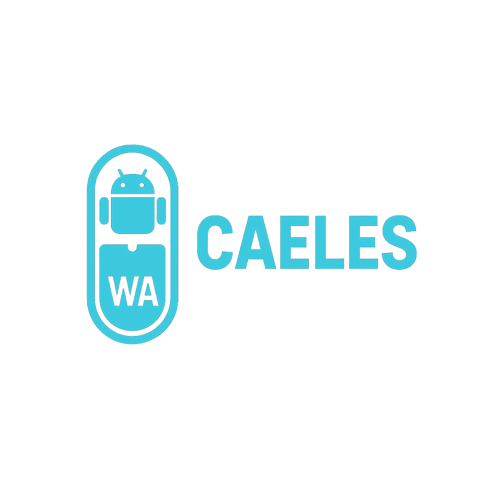
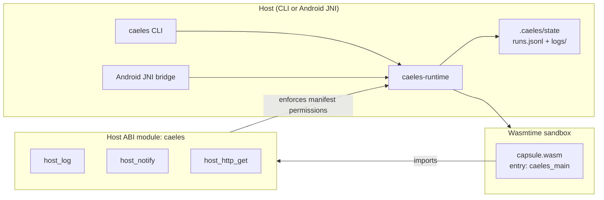

<p align="center">
  
</p>

<h1 align="center">CAELES</h1>

<p align="center">
  <em>Capsule runtime and CLI for running isolated WebAssembly modules with a small host ABI.</em>
</p>

<p align="center">
  <a href="https://github.com/jardelva96/caeles/actions/workflows/ci.yml">
    
  </a>
  
  
  
</p>

---

## Architecture



## Technical Decision (v0)

CAELES v0 standardizes capsule artifacts on:

- Target: `wasm32-unknown-unknown`
- Entrypoint export: `caeles_main`
- Host ABI module: `caeles`

Why this decision for v0:

- Keeps runtime deterministic with explicit host capabilities.
- Avoids implicit WASI imports while ABI and permission model are still evolving.
- Simplifies integration with non-desktop hosts (including Android app hosts).

Decision record:

- [docs/technical-decision-target-v0.md](docs/technical-decision-target-v0.md)

## Capsule Manifest (v0)

Required fields:

```json
{
  "id": "com.caeles.example.hello",
  "name": "Hello Capsule",
  "version": "0.1.0",
  "entry": "../../target/wasm32-unknown-unknown/debug/hello_capsule.wasm",
  "permissions": {
    "notifications": true,
    "network": false
  },
  "lifecycle": {
    "kind": "on_demand"
  }
}
```

Validation rules enforced by runtime:

- `id`, `name`, `version`, and `entry` are required and non-empty.
- `entry` must be a relative path and point to `.wasm`.
- `lifecycle.kind` must be `on_demand` in v0.
- Unknown fields are rejected (`deny_unknown_fields`).

## CLI Commands

Docker-style commands are supported:

```bash
rustup target add wasm32-unknown-unknown

caeles list
caeles run --capsule-id com.caeles.example.hello
caeles run --manifest capsules/hello-capsule/manifest.json

caeles build capsules/hello-capsule
caeles package --capsule-id com.caeles.example.hello
caeles pull com.caeles.example.hello
caeles images

caeles ps --limit 10
caeles inspect com.caeles.example.hello
caeles inspect-run run-<id>
caeles logs run-<id>
caeles rm run-<id>
```

Or through Cargo during development:

```bash
cargo run -p caeles-runtime -- list
cargo run -p caeles-runtime -- run --capsule-id com.caeles.example.hello
```

## Definition of Done (Capsule v0)

See [docs/capsule-definition-of-done-v0.md](docs/capsule-definition-of-done-v0.md).

## Security and Permissions

Current host ABI capabilities:

- `host_log`
- `host_notify`
- `host_http_get`

Permission enforcement in runtime:

- `permissions.notifications=false` blocks notifications.
- `permissions.network=false` blocks host-mediated HTTP GET.

Roadmap for stronger sandboxing:

- [docs/security-roadmap-v0.md](docs/security-roadmap-v0.md)

## Android PoC Host

Initial PoC scaffold and integration plan:

- [android/poc-host/README.md](android/poc-host/README.md)

## CI

A GitHub Actions workflow runs format checks, linting, and tests:

- `.github/workflows/ci.yml`

## License

MIT License. Copyright (c) 2026 Jardel Alves. See [LICENSE](LICENSE).
